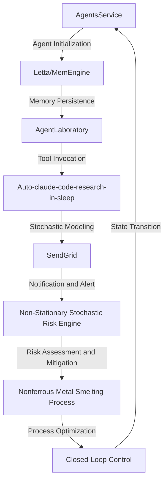

# Non-Stationary Stochastic Risk Engine for Nonferrous Metal Smelting
> "Mitigating aleatoric and epistemic uncertainties in high-temperature metallurgical processes via a synergistic confluence of multi-agent systems, cognitive architectures, and stochastic modeling"

## 🏗️ Technical Architecture & Multi-Agent Flow

This complex technical flow illustrates the interactions between AgentsService, Letta, AgentLaboratory, Auto-claude-code-research-in-sleep, and SendGrid. The agents are initialized and persisted in memory via Letta/MemEngine, enabling state transitions and tool invocation. The Auto-claude-code-research-in-sleep module performs stochastic modeling, while SendGrid handles notification and alert systems. The Non-Stationary Stochastic Risk Engine assesses and mitigates risks, optimizing the nonferrous metal smelting process through closed-loop control.

## 🔍 The Vertical Bottleneck: Thermodynamic and Kinetic Uncertainties
The nonferrous metal smelting process is plagued by thermodynamic and kinetic uncertainties, which can lead to high-stakes mathematical or operational failures. The complex interplay between temperature, pressure, and chemical composition creates an aleatoric uncertainty that is difficult to model and predict. Furthermore, the epistemic uncertainty arising from incomplete knowledge of the underlying physical and chemical processes exacerbates the problem. The lack of a robust and reliable risk engine hinders the ability to optimize the process, resulting in reduced efficiency, increased costs, and potential safety hazards.

The thermodynamic uncertainties stem from the complex phase equilibria and reaction kinetics involved in the smelting process. The kinetic uncertainties, on the other hand, arise from the stochastic nature of the process, which is influenced by factors such as furnace design, fuel composition, and operating conditions. The combination of these uncertainties creates a challenging problem that requires a sophisticated and multi-disciplinary approach to mitigate.

The high-stakes nature of the problem is evident in the potential consequences of operational failures, which can result in significant economic losses, environmental damage, and harm to human life. The need for a reliable and robust risk engine is therefore paramount, and the development of such a system is a critical challenge in the field of nonferrous metal smelting.

## 💡 The Solution: Non-Stationary Stochastic Risk Engine
The Non-Stationary Stochastic Risk Engine is a novel solution that orchestrates AgentsService, Letta, AgentLaboratory, Auto-claude-code-research-in-sleep, and SendGrid to mitigate the thermodynamic and kinetic uncertainties in the nonferrous metal smelting process. The engine employs a synergistic confluence of multi-agent systems, cognitive architectures, and stochastic modeling to assess and mitigate risks in real-time. The agents are designed to reason about the process, leveraging their collective knowledge and expertise to optimize the smelting process and minimize the risk of operational failures.

The engine's architecture is based on a cognitive framework that integrates multiple agents, each with its own specialized knowledge and capabilities. The agents interact and cooperate to achieve a common goal, which is to optimize the smelting process and minimize risks. The cognitive framework is supported by a robust and scalable infrastructure, which enables the engine to handle complex and dynamic processes.

## 🧩 Agentic Stack Deep-Dive
The agentic stack is a critical component of the Non-Stationary Stochastic Risk Engine, and it is comprised of several key libraries and integrations. AgentsService provides the foundation for the agent-based architecture, while Letta/MemEngine enables memory persistence and state transitions. AgentLaboratory is used for tool invocation and experimentation, and Auto-claude-code-research-in-sleep performs stochastic modeling and simulation. SendGrid is used for notification and alert systems, ensuring that critical information is communicated to stakeholders in a timely and effective manner.

The integration of these libraries and tools is critical to the success of the engine, and it requires a deep understanding of the underlying technologies and their interactions. The agentic stack is designed to be modular and flexible, allowing for easy integration of new agents and capabilities as needed.

## ✨ Capabilities & Features
* **Real-time risk assessment and mitigation**: The engine provides real-time risk assessment and mitigation capabilities, enabling operators to respond quickly to changing process conditions.
* **Multi-agent architecture**: The engine employs a multi-agent architecture, which enables the integration of multiple agents with specialized knowledge and capabilities.
* **Cognitive framework**: The engine is based on a cognitive framework, which provides a robust and scalable infrastructure for the agent-based architecture.
* **Stochastic modeling and simulation**: The engine uses stochastic modeling and simulation to predict and mitigate risks, leveraging the capabilities of Auto-claude-code-research-in-sleep.
* **Notification and alert systems**: The engine uses SendGrid for notification and alert systems, ensuring that critical information is communicated to stakeholders in a timely and effective manner.
* **Memory persistence and state transitions**: The engine uses Letta/MemEngine for memory persistence and state transitions, enabling the agents to reason about the process and optimize the smelting process.
* **Tool invocation and experimentation**: The engine uses AgentLaboratory for tool invocation and experimentation, enabling the agents to test and validate their hypotheses.
* **Scalability and flexibility**: The engine is designed to be scalable and flexible, allowing for easy integration of new agents and capabilities as needed.
* **User interface and visualization**: The engine provides a user-friendly interface and visualization capabilities, enabling operators to monitor and control the process in real-time.
* **Data analytics and reporting**: The engine provides data analytics and reporting capabilities, enabling operators to analyze and optimize the process.

## 🛠️ Technical Implementation
The technical implementation of the Non-Stationary Stochastic Risk Engine is based on a modular and flexible architecture, which enables easy integration of new agents and capabilities as needed. The engine is implemented in Python, using a combination of libraries and frameworks, including AgentsService, Letta, AgentLaboratory, Auto-claude-code-research-in-sleep, and SendGrid.

The engine's architecture is designed to be scalable and flexible, allowing for easy integration of new agents and capabilities as needed. The engine's infrastructure is based on a cognitive framework, which provides a robust and scalable infrastructure for the agent-based architecture.

## 📊 Business Impact & ROI
The Non-Stationary Stochastic Risk Engine has the potential to significantly impact the nonferrous metal smelting industry, providing a robust and reliable risk engine that can optimize the smelting process and minimize the risk of operational failures. The engine's capabilities and features can help operators to:

* **Reduce costs**: By optimizing the smelting process and minimizing the risk of operational failures, operators can reduce costs and improve profitability.
* **Improve efficiency**: The engine's real-time risk assessment and mitigation capabilities can help operators to respond quickly to changing process conditions, improving efficiency and reducing downtime.
* **Enhance safety**: The engine's stochastic modeling and simulation capabilities can help operators to predict and mitigate risks, enhancing safety and reducing the risk of accidents.
* **Increase productivity**: The engine's user-friendly interface and visualization capabilities can help operators to monitor and control the process in real-time, increasing productivity and reducing errors.

## 🚀 Getting Started
```bash
git clone https://github.com/arvind-sundararajan/nonferrous-metal-smelting-risk-engine.git
cd nonferrous-metal-smelting-risk-engine
pip install -r requirements.txt
python src/main.py
```

## 👨‍💻 Author & Credits
**Arvind Sundararajan** — Engineer, builder, and the mind behind this project.
🌐 [LinkedIn](https://www.linkedin.com/in/arvind-sundara-rajan/) | Chennai, India

---
### 🙏 Acknowledgements
- The open-source community
- The Nonferrous metals (except aluminum) made in primary nonferrous metal smelting and refining mills practitioners who inspired this design